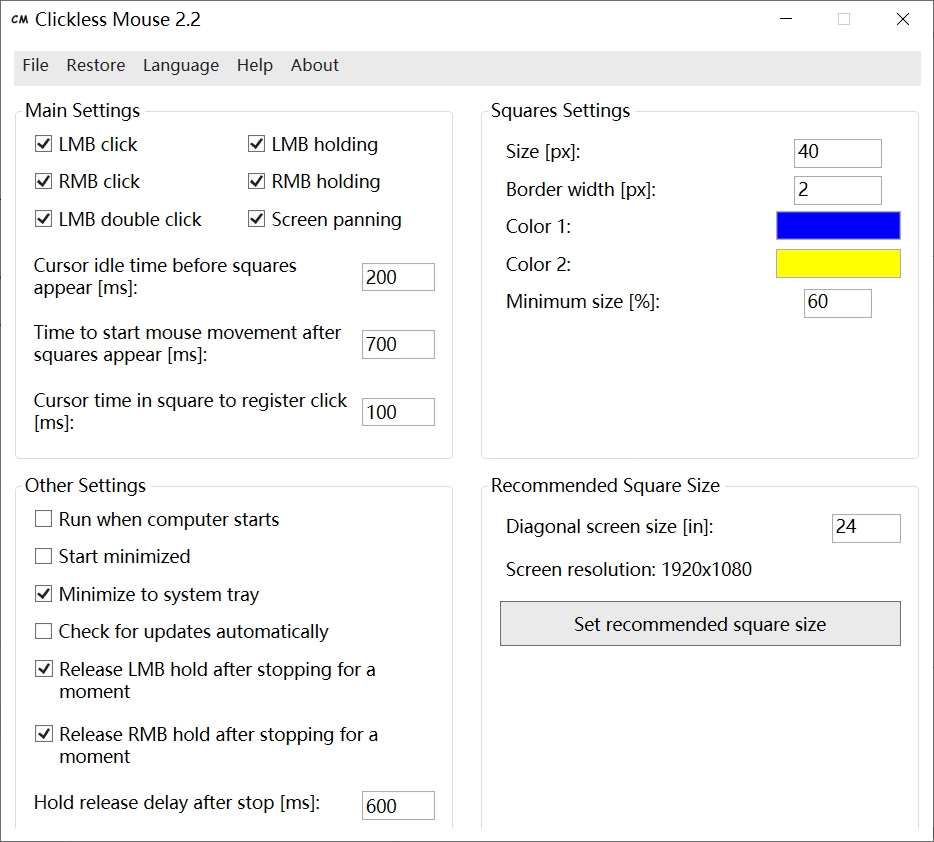
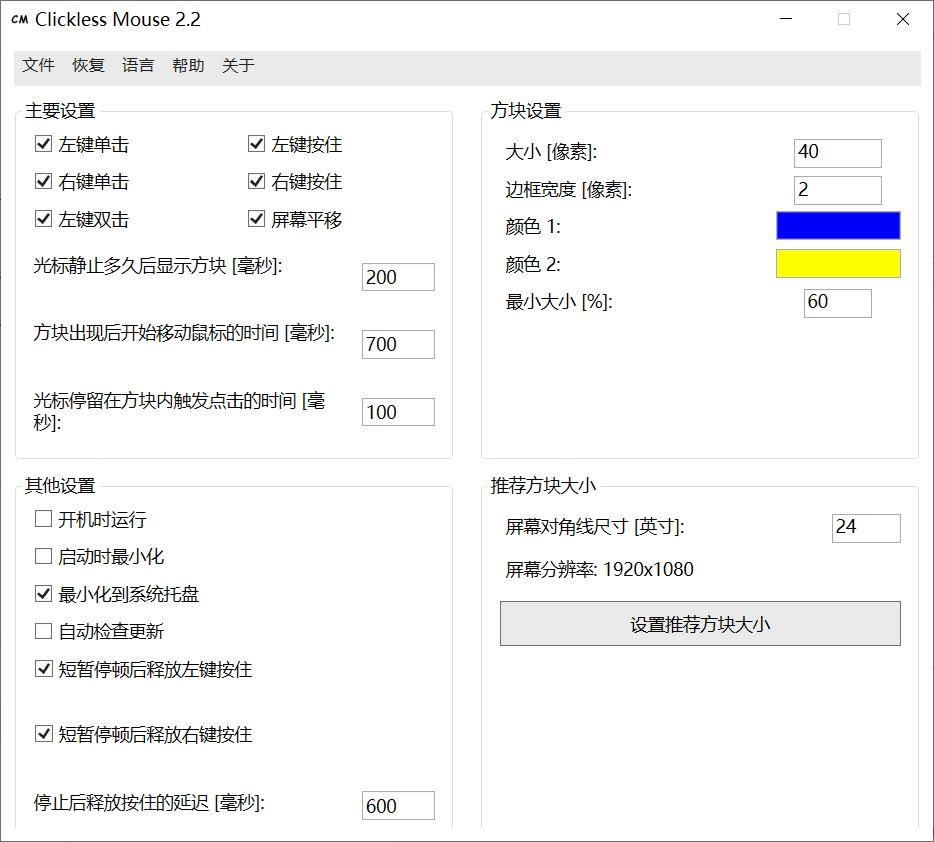

# Clickless Mouse

[English README](./readme.md)

## 下载
[下载最新版本](https://github.com/ProperCode/Clickless-Mouse/releases)

当前仓库对应版本：`2.2`

**界面语言：** 英语、波兰语、中文

## 与原版项目的差异

当前仓库不是上游 `ProperCode/Clickless-Mouse` 的原样镜像，而是在原版基础上做了本地化和功能补充。与原版相比，这个版本重点包括：
- 新增中文界面和中文使用说明文本。
- 新增面向中文读者的 `readme_CN.md`。
- 新增左右键按住后“短暂停顿自动释放”的可配置行为。
- 新增一个红色小圆点，用于提示当前正处于鼠标按住状态。
- 清理了仓库中历史遗留的 Visual Studio 与构建产物，并补充了后续忽略规则。

## 简介

Clickless Mouse 是一个 Windows 桌面应用，允许用户仅通过移动鼠标完成点击操作，而不必实际按下鼠标按键。它主要面向重复性劳损、腕管综合征、部分运动障碍用户，以及鼠标按键临时损坏的场景。

程序会监测鼠标移动状态。当光标静止一段时间后，会在光标附近显示功能方块。将光标移动到不同方块中，可以触发以下操作：
- 上方中间方块 = 左键双击
- 左上方块 = 左键单击
- 右上方块 = 右键单击
- 左侧方块 = 左键按住开/关
- 右侧方块 = 右键按住开/关

当光标在某个方块中停留足够长时间后，程序会将光标移回原来的位置，并执行对应操作。

当前代码里的其他行为：
- 当光标靠近屏幕上边缘时，上方三个功能方块会显示在光标下方。
- 当光标靠近屏幕左右边缘时，方块会自动缩小，以保证至少有一部分仍然可见。
- 不需要的方块可以单独禁用。
- 可以开启屏幕平移模式，将屏幕边缘映射为方向键按下。
- 左键按住和右键按住都可以设置为“短暂停顿后自动释放”。
- 程序在按住鼠标按键期间会显示一个红色小圆点提示当前处于按住状态。
- 版本 `2.2` 支持自动检查更新。
- 程序仅支持窗口模式或无边框窗口模式，不支持独占全屏。

## 初次使用

1. 输入屏幕对角线尺寸，然后点击 `Set recommended square size`。
2. 只启用你实际需要的鼠标动作。
3. 如果用户有运动障碍，可以适当增大静止等待时间、开始移动时间和方块尺寸。

程序强制的最小值如下：
- 光标静止多久后显示方块 [ms]：`100`
- 停止后释放按住的延迟 [ms]：`10`
- 方块出现后开始移动鼠标的时间 [ms]：`300`
- 光标停留在方块内触发点击的时间 [ms]：`10`
- 方块大小 [px]：`10`
- 边框宽度 [px]：`1`
- 最小大小 [%]：`10`

## 运行要求

- Windows
- `.NET Framework 4.5.2`
- 运行 `2.2` 版本时需要管理员权限

程序会将设置保存在可执行文件所在目录下的 `settings.txt` 中。启用开机启动后，还会在同目录生成一个 `.vbs` 启动脚本供自启动项调用。

`settings.txt` 对旧版本布局保持向后兼容。较新的版本会在原有字段后追加按住释放选项和所选界面语言。

## 构建

使用 Visual Studio 打开 `Clickless Mouse/Clickless Mouse.sln`，构建 `Clickless Mouse` 项目的 `Debug` 或 `Release` 配置即可。

项目结构：
- `Clickless Mouse/Clickless Mouse.sln` - Visual Studio 解决方案入口
- `Clickless Mouse/Clickless Mouse/` - WPF 应用源码
- `Clickless Mouse/Clickless Mouse/HoldIndicator.cs` - 用于显示按住状态的 WinForms 叠层提示窗口
- `other/latest_version.txt` - 自动更新检查使用的远程版本号文件
- `other/images/` - README 与程序说明中使用的图片资源

## 截图

英文界面：

中文界面：

## 奖项

## Bug 反馈与建议

如需报告 bug 或提出建议，请使用下图中的邮箱地址，并尽量附上复现步骤与截图。

## 相关项目

[Aspiring Keyboard](https://github.com/ProperCode/Aspiring-Keyboard)

[Work by Speech](https://github.com/ProperCode/Work-by-Speech)
